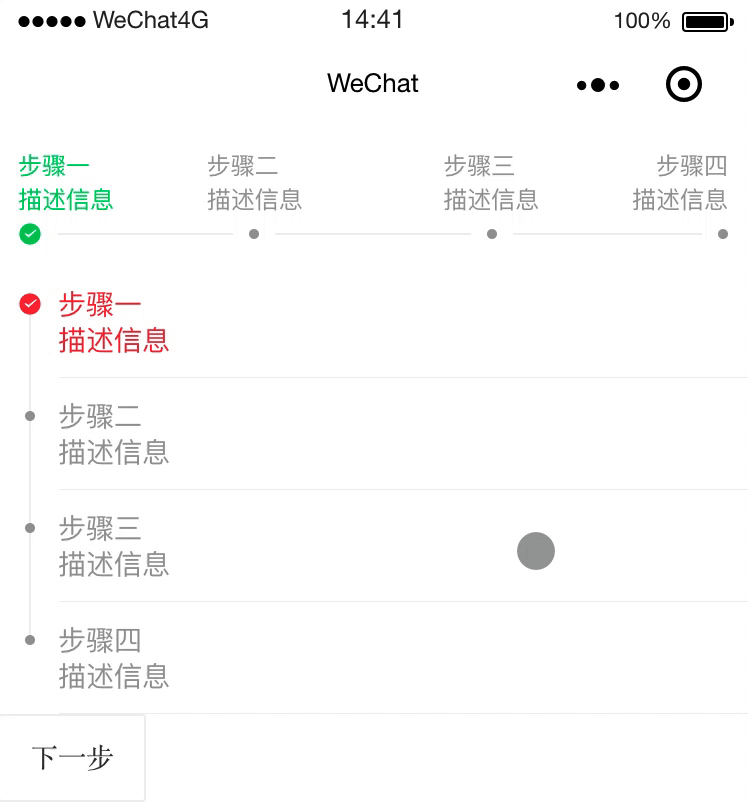
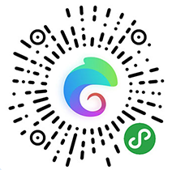

## Why

We selected the most popular WeChat UI libraries to help you speed up your Mini Programs projects. 

Need a calendar, slider, or accordion? No need to reinvent the wheel 😉 Start with a UI library!

👉 This tutorial introduces the notion of **Custom Components** in WeChat.

## Table of Contents

- [WeUI by WeChat](#weui-by-wechat)

- [Vant by Youzan](#vant-by-youzan)

- [Wux](#wux)

- [Color UI](#color-ui)

## WeUI by WeChat

The UI library by **WeChat official design team**, including useful widgets/modules. A little plain, but super classic. Your visitors will feel at home.

**1. WeUI WXSS**

[WXSS Library](https://github.com/Tencent/weui-wxss/)

**2. WeUI Design**

[Sketch / Photoshop package](https://github.com/weui/weui-design)

### Preview:


### How to use it?

- Clone or download the [WeUI WXSS repo](https://github.com/Tencent/weui-wxss) and move the [dist/style/](https://github.com/Tencent/weui-wxss/tree/master/dist/style) folder inside your Mini Program project


```
git clone https://github.com/Tencent/weui-wxss.git
```

- Copy the initial [App.wxss](https://github.com/Tencent/weui-wxss/blob/master/dist/app.wxss) in your Mini Program project

- Navigate [examples](https://github.com/Tencent/weui-wxss/tree/master/dist/example) of components and use all relevant `wxml` + `js` code provided


## Vant by Youzan

[Vant Weapp](https://github.com/youzan/vant-weapp) is provided by the popular SaaS e-commerce platform **Youzan**.

If you want to make a Mini Program for **e-commerce**, **catering**, **take-out platform**, **ticket booking**, Vant is a great choice.

### Preview:


### How to use it?

⚠️ This library is based on WeChat's **Custom Components** feature. We can create and reuse them in our apps. Start by reading the [WeChat official documentation here](https://developers.weixin.qq.com/miniprogram/en/dev/framework/custom-component/).

- Clone or download the [Vant Weapp repo](https://github.com/youzan/vant-weapp) and move the [dist/](https://github.com/youzan/vant-weapp/tree/dev/dist) folder inside your Mini Program project

```shell
git clone https://github.com/youzan/vant-weapp.git
```

- Navigate all [examples](https://github.com/youzan/vant-weapp/tree/dev/example/pages) and register/use components you need.

📌 Most components require a set of data and some custom functions, don't forget to take the JS code!

**One by one**

You can add ONE custom component at the time and use it in your page. Example: `<van-card/>`

`page.JSON:`

```json
{
  "usingComponents": {
    "van-card": "/dist/card/index"
  }
}

```

`page.WXML:`

```html
<van-card
  num="2"
  price="2.00"
  desc="描述信息"
  title="2018秋冬新款男士休闲时尚军绿飞行夹克秋冬新款男"
  thumb="{{ imageURL }}"
/>
```

`page.JS:`

```js
data: {
    imageURL: '//img.yzcdn.cn/upload_files/2017/07/02/af5b9f44deaeb68000d7e4a711160c53.jpg'
  }

```


**... or ALL at once**

You can also register ALL components at once in your `app.json` and use them later in your pages.

`app.JSON`

```
[...]

"usingComponents": {
    "van-action-sheet": "/dist/action-sheet/index",
    "van-area": "/dist/area/index",
    "van-badge": "/dist/badge/index",
    "van-badge-group": "/dist/badge-group/index",
    "van-button": "/dist/button/index",
    "van-card": "/dist/card/index",
    "van-cell": "/dist/cell/index",
    "van-cell-group": "/dist/cell-group/index",
    "van-checkbox": "/dist/checkbox/index",
    "van-checkbox-group": "/dist/checkbox-group/index",
    "van-col": "/dist/col/index",
    "van-dialog": "/dist/dialog/index",
    "van-field": "/dist/field/index",
    "van-goods-action": "/dist/goods-action/index",
    "van-goods-action-icon": "/dist/goods-action-icon/index",
    "van-goods-action-button": "/dist/goods-action-button/index",
    "van-icon": "/dist/icon/index",
    "van-loading": "/dist/loading/index",
    "van-nav-bar": "/dist/nav-bar/index",
    "van-notice-bar": "/dist/notice-bar/index",
    "van-notify": "/dist/notify/index",
    "van-panel": "/dist/panel/index",
    "van-popup": "/dist/popup/index",
    "van-progress": "/dist/progress/index",
    "van-radio": "/dist/radio/index",
    "van-radio-group": "/dist/radio-group/index",
    "van-row": "/dist/row/index",
    "van-search": "/dist/search/index",
    "van-slider": "/dist/slider/index",
    "van-stepper": "/dist/stepper/index",
    "van-steps": "/dist/steps/index",
    "van-submit-bar": "/dist/submit-bar/index",
    "van-swipe-cell": "/dist/swipe-cell/index",
    "van-switch": "/dist/switch/index",
    "van-switch-cell": "/dist/switch-cell/index",
    "van-tab": "/dist/tab/index",
    "van-tabs": "/dist/tabs/index",
    "van-tabbar": "/dist/tabbar/index",
    "van-tabbar-item": "/dist/tabbar-item/index",
    "van-tag": "/dist/tag/index",
    "van-toast": "/dist/toast/index",
    "van-transition": "/dist/transition/index",
    "van-tree-select": "/dist/tree-select/index",
    "van-datetime-picker": "/dist/datetime-picker/index",
    "van-rate": "/dist/rate/index",
    "van-collapse": "/dist/collapse/index",
    "van-collapse-item": "/dist/collapse-item/index",
    "van-picker": "/dist/picker/index"
  }
```

`page.WXML`
 
 ```html
<van-steps
  steps="{{ steps }}"
  active="{{ active }}"
/>

<van-steps
  steps="{{ steps }}"
  active="{{ active }}"
  direction="vertical"
  active-color="#f44"
/>

<van-button bind:click="nextStep">下一步</van-button>
 ```
 
`page.JS`

```javascript
data: 
{
	active: 0,
	steps: [
	  {
	    text: '步骤一',
	    desc: '描述信息'
	  },
	  {
	    text: '步骤二',
	    desc: '描述信息'
	  },
	  {
	    text: '步骤三',
	    desc: '描述信息'
	  },
	  {
	    text: '步骤四',
	    desc: '描述信息'
	  }
	]
},
nextStep() {
	this.setData({
	  active: ++this.data.active % 4
	});
}

```



## Wux

Wux is an open source library with the highest diversity: over 60 reusable and extensible WeChat Mini Program **Custom Components.** 

You will want to check its **progress loops**, **skeleton screens**, **filter bars**, **numeric keypads**, and **result pages**.

### Preview


### How to use it?

- Clone or download the [Wux Weapp repo](https://github.com/wux-weapp/wux-weapp/) and move the [dist/](https://github.com/wux-weapp/wux-weapp/tree/master/dist) folder inside your Mini Program project

- Navigate all [examples on Github](https://github.com/wux-weapp/wux-weapp/tree/master/example/pages) or the [official documentation](https://wux-weapp.github.io/wux-weapp-docs/#/calendar) and register/use components you need.

Example: [wux-button](https://wux-weapp.github.io/wux-weapp-docs/#/button)

`page.JSON`

```json
"usingComponents": {
    "wux-button": "../../dist/button/index"
}
```

`page.WXML`

```html
<wux-button size="small" block type="balanced"> OK </wux-button>
<wux-button size="default" block outline type="balanced"> OK </wux-button>
<wux-button size="large" block type="dark"> OK </wux-button>
```

`page.WXSS`

```css
@import '../../dist/styles/index.wxss';
```


## Color UI

ColorUI is a component library that focuses on visual interaction. Compared to WeUI's plain style, ColorUI has bright colors and diverse shapes. You will like its **timelines**, **step bars**, **chat pages**, **modal windows**.

### Preview



### How to use it

- Clone or download the [Color UI repo](https://github.com/youzan/vant-weapp) and move the [demo/colorui/](https://github.com/weilanwl/ColorUI/tree/master/demo/colorui) folder inside your Mini Program project

- Inside `app.WXSS`, import two stylesheets:


```css
@import "colorui/main.wxss";
@import "colorui/icon.wxss";
```

- This library is using a **custom navigation bar**! Add this inside `app.json`:

```json
"window": {
	"navigationStyle": "custom"
},
"usingComponents": {
    "cu-custom":"/colorui/components/cu-custom"
}
```

- Inside `app.js`:

```js
onLaunch: function() {
    wx.getSystemInfo({
      success: e => {
        this.globalData.StatusBar = e.statusBarHeight;
        let custom = wx.getMenuButtonBoundingClientRect();
        this.globalData.Custom = custom;  
        this.globalData.CustomBar = custom.bottom + custom.top - e.statusBarHeight;
      }
    })
},

```

- At the top of any `page.wxml`, always use:

```html
<cu-custom bgColor="bg-gradual-pink" isBack="{{true}}">
	<view slot="backText">返回</view>
	<view slot="content">导航栏</view>
</cu-custom>
```

- Navigate [examples](https://github.com/weilanwl/ColorUI/tree/master/demo/pages) of pages or components and copy paste all relevant `wxml` + `js` code provided


